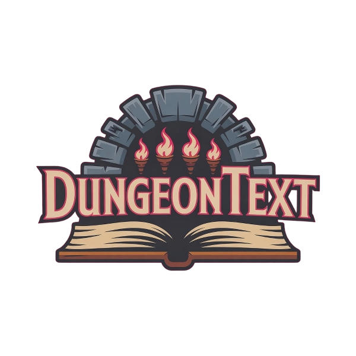

# Dungeon Text - AI Driven Fantasy RPG

<p align="center">
  
</p>

## Description


Dungeon Text is a text-based role-playing game (RPG) powered by AI. Explore a dynamic world, interact with characters generated by AI, undertake quests, and shape your own adventure through text commands. The game utilizes Google's Gemini AI to create emergent narratives, dialogues, and scenarios.


## Features

*   **AI-Powered Narrative:** Experience a unique story every time with AI-generated descriptions, dialogues, quests, and events.
*   **Dynamic World:** Interact with NPCs whose personalities and actions can be influenced by the AI.
*   **Text-Based Interface:** Classic RPG feel with interaction driven by text commands.
*   **Quest System:** Discover and complete quests generated dynamically by the AI DM.
*   **Character Progression:** (Basic implementation) Choose a class and manage stats.
*   **Resizable Window:** Play in a window size that suits you.
*   **Sound Effects & Music:** Basic audio feedback for actions and atmosphere.

## Installation

1.  **Clone the Repository:**
    ```bash
    git clone https://github.com/your-username/text_rpg_project.git # Replace with your repo URL
    cd text_rpg_project
    ```

2.  **Set up Environment & Install Dependencies:**
    *   **Windows:**
        *   Make sure you have Python 3 installed and added to your PATH.
        *   Run the initialization script:
            ```bash
            .\initialize_project.bat
            ```
        *   The script will create a virtual environment (`venv`), install necessary packages, and prompt you for your Gemini API Key, saving it to a `.env` file.
    *   **Linux / macOS:**
        *   Make sure you have Python 3 installed.
        *   Make the initialization script executable:
            ```bash
            chmod +x initialize_project.sh
            ```
        *   Run the script:
            ```bash
            ./initialize_project.sh
            ```
        *   The script will create a virtual environment (`venv`), install necessary packages, and prompt you for your Gemini API Key, saving it to a `.env` file.

3.  **Gemini API Key:**
    *   The initialization scripts will prompt you to enter your API key for Google Gemini (see [Google AI Studio](https://aistudio.google.com/app/apikey) to obtain one).
    *   This key is stored locally in a `.env` file at the project root. **Do not commit the `.env` file to version control.** Add `.env` to your `.gitignore` file.

## How to Run

1.  **Activate the Virtual Environment:**
    *   **Windows:**
        ```bash
        venv\Scripts\activate.bat
        ```
    *   **Linux / macOS:**
        ```bash
        source venv/bin/activate
        ```

2.  **Run the Game:**
    ```bash
    python main.py
    ```

3.  **Deactivate the Virtual Environment (when finished):**
    ```bash
    deactivate
    ```

## Dependencies

*   Python 3.x
*   Pygame (`pygame`)
*   Google Generative AI SDK (`google-generativeai`)
*   Python Dotenv (`python-dotenv`) - For managing the API key.

The initialization scripts handle the installation of these Python packages within the virtual environment.

## Configuration

*   **API Key:** The Google Gemini API key is configured via the `.env` file created during initialization. The application loads this key automatically.
*   **Game Settings:** Volume and resolution can be adjusted within the game's Settings menu.
*   **Logging:** Game activity and errors are logged to files in the `logs/` directory.

## Contributing

Contributions are welcome! Please feel free to submit pull requests or open issues.

## License

Please add a license file (e.g., MIT, GPL) to define how others can use your project.
